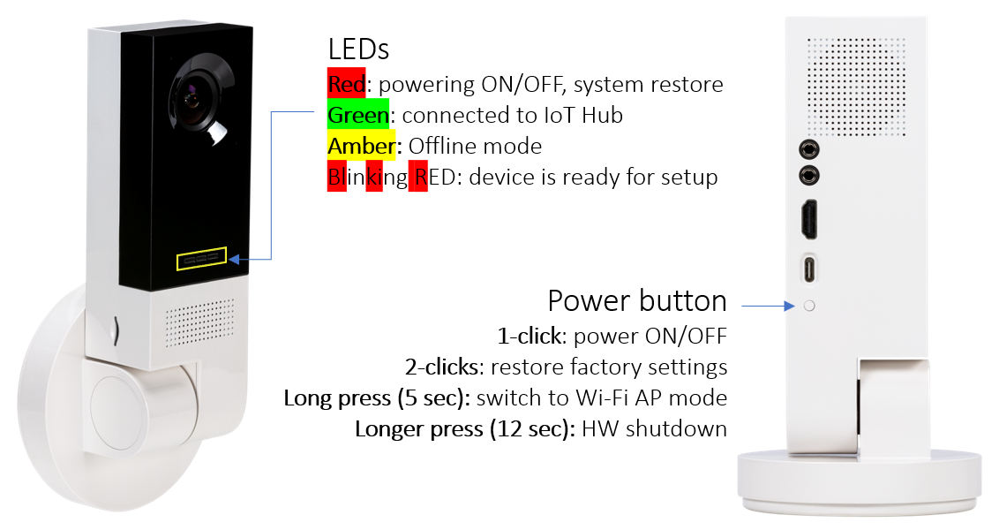

# Gitter

https://gitter.im/Microsoft/vision-ai-developer-kit

# Setup

https://azure.github.io/Vision-AI-DevKit-Pages/docs/Get_Started/#configure-your-camera-to-connect-to-azure-as-an-iot-edge-device

get iot edge connection string
HostName=iot-hub-vai.azure-devices.net;DeviceId=edge-test-vai;SharedAccessKey=WpEINOvn9dgLk1aUMFFxYbdNTq7i76e2ciG0QolJNxY=

`brew install homebrew/cask/android-platform-tools`

# Can SSH
grdegr

lorule password

# References
Documentation for the Microsoft Vision AI Developer kit can be found on GitHub at https://aka.ms/VisionAIDocs

Join the Microsoft AI Developer Tech Community for support, conversations with other Microsoft Vision AI developers and more at https://aka.ms/VisionAITechComm