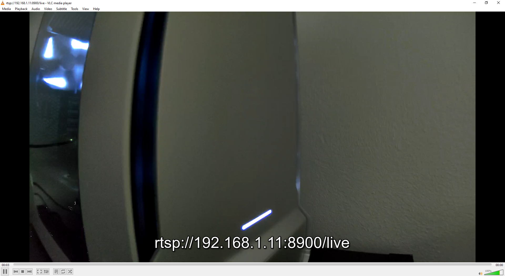

<p align="center"></p>

|   |   |
|---|---|
|||

# Setup

[Quick Start](https://azure.github.io/Vision-AI-DevKit-Pages/docs/Get_Started/#configure-your-camera-to-connect-to-azure-as-an-iot-edge-device) then [Custom Vision Service](https://azure.github.io/Vision-AI-DevKit-Pages/docs/Tutorial-HOL_Using_the_VisionSample/#). [Take pictures](https://azure.github.io/Vision-AI-DevKit-Pages/docs/train/#take-pictures-with-the-camera) with the camera.

Managing the device with the Android Debug Bridge, `./adb.exe devices` to confirm device is connected to your machine, `./adb.exe shell ifconfig wlan0` to view the devices ip. Setup the debug [bridge on Ubuntu](https://www.linuxbabe.com/ubuntu/how-to-install-adb-fastboot-ubuntu-16-04-16-10-14-04).

To capture pictures with the device follow the README in the python_iotcc_sdk directory. There's test there for device reset and other adb management tasks as well as several python SDK examples. After going through the README open up VLC

```
D:\_mr.robot\vision-ai-developer-kit\samples\research\ai-vision-devkit-get-started-legacy\modules\VisionSampleModule\python_iotcc_sdk\tests>python test-preview.py --ip 192.168.1.11

Python 3.7.4 (tags/v3.7.4:e09359112e, Jul  8 2019, 20:34:20) [MSC v.1916 64 bit (AMD64)]

supported resolutions: ['4K', '1080P', '720P', '480P']
supported encodetype: ['HEVC/H.265', 'AVC/H.264']
supported bitrates: ['512Kbps', '768Kbps', '1Mbps', '1.5Mbps', '2Mbps', '3Mbps', '4Mbps', '6Mbps', '8Mbps', '10Mbps', '20Mbps']
supported framerates: [24, 30]
<contextlib._GeneratorContextManager object at 0x000002AD3F1F5248>
rtsp://192.168.1.11:8900/live
Running for 60 seconds
Changing preview resolution to 4K and encode type to AVC
Invalid value: display_out should 0/1, using current display_out:1
<contextlib._GeneratorContextManager object at 0x000002AD3F18BE48>
Running for 60 seconds
```

`python test-preview.py --ip 192.168.1.11` runs as expected



[Stream](https://azure.github.io/Vision-AI-DevKit-Pages/docs/RTSP_stream/) only one per browser session
```
rtsp://<IP address>:8900/live
^ VLC broken?

http://<IP address>:3000/
^ works in browser
```

# Models I've used

MyMXCHIP Model

AIVisionDevKitGetStartedModule
```
Name - AIVisionDevKitGetStartedModule
Image URI - mcr.microsoft.com/aivision/visionsamplemodule:1.1.0-arm32v7
```
use `visionsamplemodule:latest` for latest

Container create default options

```
{
  "HostConfig": {
    "Binds": [
      "/data/misc/camera:/app/vam_model_folder",
      "/run/systemd:/run/systemd"
    ]
  }
}
```

Default twin's desired properties
```
{
  "properties.desired": {
    "ModelZipUrl": "<blob SAS URL>",
    "TimeBetweenMessagesInSeconds": "12",
    "ObjectsOfInterest": "ALL",
    "ShowVideoOverlay": "true",
    "Bitrate": "1.5Mbps",
    "Resolution": "1080P",
    "VideoOverlayConfig": "inference",
    "FrameRate": "30",
    "FreqToSendMsg":12,
    "HdmiDisplayActive": "true",
    "VideoAnalyticsEnabled": "true",
    "ShowVideoPreview": "true",
    "Codec": "AVC/H.264"
  }
}
```

|   |   |
|---|---|
|||


WebStreamModule
```
Name - WebStreamModule
Image URI - drwedgecr.azurecr.io/webstreammodule:0.0.12-arm32v7
```

# LOGS

https://azure.github.io/Vision-AI-DevKit-Pages/docs/Review_logs/

```
adb shell docker logs -f edgeAgent
After you see a “Start module (your module name)” message, you can use

adb shell docker logs -f <your module name>
to review logs for your module(s).
```

# SSH
commands on board `curl`, `docker`,  `sftp`, `vi`

# References
* [Custom Model](https://www.customvision.ai/)
* [Custom Model Guide](https://azure.github.io/Vision-AI-DevKit-Pages/docs/Tutorial-HOL_Using_the_VisionSample/)
* [Custom Vision Service](https://www.customvision.ai/)
* [Gitter](https://gitter.im/Microsoft/vision-ai-developer-kit)
* Join the Microsoft AI Developer Tech Community for support, conversations with other Microsoft Vision AI developers and more at https://aka.ms/VisionAITechComm
* Microsoft Vision AI Developer kit docs https://aka.ms/VisionAIDocs
* Samples and more in [Microsoft Vision AI repo](https://github.com/Microsoft/vision-ai-developer-kit)
