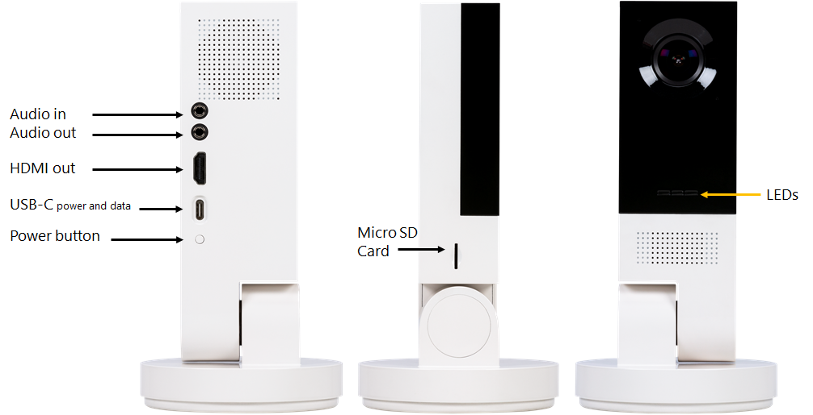
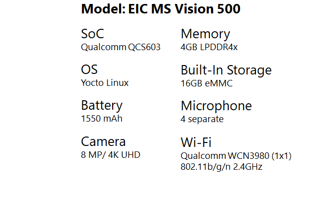

# Gitter

https://gitter.im/Microsoft/vision-ai-developer-kit




# Setup

1

https://azure.github.io/Vision-AI-DevKit-Pages/docs/Get_Started/#configure-your-camera-to-connect-to-azure-as-an-iot-edge-device

get iot edge connection string

`brew install homebrew/cask/android-platform-tools`

2

vision ai model for edge
https://azure.github.io/Vision-AI-DevKit-Pages/docs/Deploy_Model_IoT_Hub/#

```
Name - VisionSample
Image URI - mcr.microsoft.com/aivision/visionsamplemodule:latest
```

3

https://azure.github.io/Vision-AI-DevKit-Pages/docs/RTSP_stream/

`rtsp://<IP address>:8900/live` VLC broken?

`http://<IP address>:3000/` works in browser   


LOGS

https://azure.github.io/Vision-AI-DevKit-Pages/docs/Review_logs/

```
adb shell docker logs -f edgeAgent
After you see a “Start module (your module name)” message, you can use

adb shell docker logs -f <your module name>
to review logs for your module(s).
```

# Can SSH
commands on board `curl`, `docker`,  `sftp`, `vi`

directories
```
/
    /.
    /..
    /WEBSERVER
    /bin
    /boot
    /bt_firmware
    /build.prop
    /cache
    /data
    /dev
    /dsp
    /etc
    /firmware
        /firmware/image
        /firmware/verinfo
            ver_info.txt
    /home
        /home/{usrname}
        /home/root
        /home/peadbody
    /lib
    /lost+found
    /media
    /mnt
    /persist
    /proc
    /run
    /sbin
    /sdcard -> /mnt/sdcard
    /share
    /sys
    /system
    /systemrw
    /target
    /tmp -> /var/tmp
    /usr
    /var
    /vendor
```


# References
Documentation for the Microsoft Vision AI Developer kit can be found on GitHub at https://aka.ms/VisionAIDocs

Join the Microsoft AI Developer Tech Community for support, conversations with other Microsoft Vision AI developers and more at https://aka.ms/VisionAITechComm